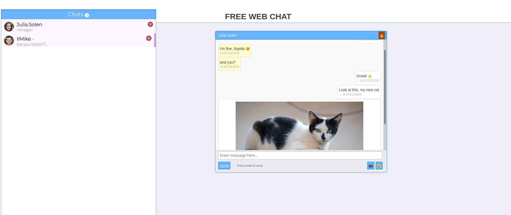

# FreeWebChat

FreeWebChat has a backend developed in PHP7+MySQL that exposes REST APIs to the frontend written using JQuery (Ajax) and HTML5.
The database access is performed through [PDO](https://www.php.net/manual/en/book.pdo.php).
The project focuses on a one-to-one chat, however it should be easy to implement chat rooms.

This chat can be easily integrated in existing web applications.
Thus, the source code doesn't include user login and register pages.
The chat should be configured to use the users managed by your web app (see `config.php` and `js/chat.js`).

Features:
*  Message read/unread mark
*  (near)Real Time (ajax polling)
*  Photo Upload
*  Emoji
*  Smartphone/Tablet support (dynamic resize)
*  Multiple themes
*  Chat history panel
*  Show status (online/offline) for contacts in the chat history
*  Block/Unblock users
*  Multiple languages support (english, italian)
*  Chat and relative messages deletion
*  Bad words filter
*  Compress and resize uploaded images
*  Highlight other chats with unread messages

# Backend API
The APIs return JSON objects and can be accessed only by authenticated users (based on session cookie).

Below are reported the implemented APIs grouped by HTTP methods.

Method **GET**:
*  `getUserInfo(username)`: Returns JSON representing the current logged user or, if username is specified, returns details about the user with that username
*  `getChatCount`: Returns the total number of open chats of the current user
*  `didIBlock(dstuid)`: Returns a boolean value (JSON encoded) that is true if the current user has blocked the user with id equal to dstuid otherwise returns false
*  `UnblockOtherUser(dstuid)`: Unblocks the user with id equal to dstuid
*  `blockOtherUser(dstuid)`: Blocks the user with id equal to dstuid
*  `getChatRecipients`: Returns an array containing all the users that have an open chat with the current user
*  `getChatMessages(chatid)`: Returns all the chat messages belonging to the specified chat (ascending order)
*  `getLastChatMessages(chatid,limit)`: Returns <limit> (default: 1) messages belonging to the specified chat (descending order)
*  `getUnreadMessages(fromuid)`: Returns message objects sent from the specified user marked as unread. If fromuid is not specified, returns all unread messages.
*  `getLastActivity(uid)`: Returns a datetime indicating the last activity of the specified user

Method **POST**:
*  `postNewMessage(msg,to,type)`: Save a new message with content equal to `msg`, where the destination user is specified by `to`. The `type` of the message can be `text` or `file`.
*  `setReadMessages(id[])`: Marks all the message id(s) as read
*  `upload(dstuser)`: Uploads a file and sends it to dstuser

Method **DELETE**:
*  `deleteMessage(msgid)`: Delete a message with id equal to msgid
*  `deleteChat(chatid)`: Delete the specified chat and all its messages
